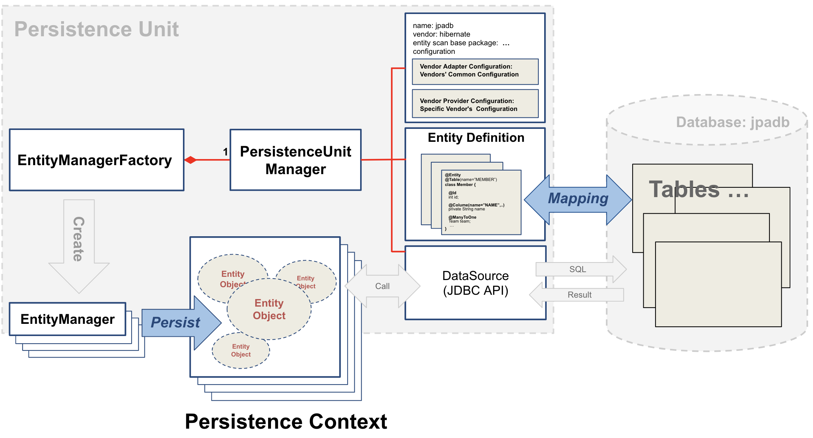

## 주요 개념 



#### 1. Persistence Unit
#### 2. EntityManagerFactory & PersistenceUnitManager
#### 3. EntityManager & Persistence Context


## 해야 하는 것
#### 1. Persistence Unit(단위)로 설정 하기 

#### 2. Mapping
1. Entities Class & Tables: @Entity & @Table
2. Primary Key: @Id
3. Field & Column: @Column
4. Association: @ManyToOne, @OneToMany,,,

#### 3. Pesistence of Entity Object
1. Persistence Context
2. persist()
3. find(), JPQL(QueryDSL)
4. remove()
5. update


## Configuration

#### 1. 설정 대상
1. 물리적 Database와 1:1의 JPA 개념인 Persistence Unit를 설정한다.
    - EntityManageFactory(LocalContainerEntityManagerFactoryBean) Bean 설정
    - 주로 LocalContainerEntityManagerFactoryBean의 메소드를 통해 PersistenceUnitManager를 설정
2. PlatformTransactionManager: JpaTransactionManager

#### 2. Persistence Unit Configuration
1. DataSource(JDBC)
2. Entity Mapping & Entity-Scan Location(Base Package)
3. EntityManagerFactory 빈 설정
4. PlatformTransactionManager 빈 설정
5. Vendor Adapter: JPA Vendor Common Configuration
    - database
    - database-platform
    - generate-ddl
    - mapping-resources
    - show-sql
    - defer-datasource-initialization: : 추가 Java Code 필요*
    - open-in-view: : 추가 Java Code 필요*

6. Vendor Provider(Hibernate) : Vendor Specific Configuration
    - hibernate.dialect
    - hibernate.show_sql
    - hibernate.format_sql
    - hibernate.use_sql_comments
    - hibernate.hbm2ddl.auto
    - hibernate.id.new_generator_mappings
    - naming strategy: 추가 Java Code 필요*


#### 3. ex01.config.* : Vendor Adapter & Vendor Provider 제외한 공통 설정 : Spring Bean Configuration(Explicity)
1. DataSource 빈 설정
2. Entity Mapping: ex01.domain01_05.Pet
3. LocalContainerEntityManagerFactoryBean Bean 설정
   1) setPersistenceUnitName(...) : Persistence Unit Name
   2) setPackagesToScan(...) : Entity-Scan Location(Base Package)
   3) setMappingResources : 설정 안함 
   4) setDataSource : DataSource Bean DI 
   5) setJpaVendorAdapter : Vender Adapter(HibernateJpaVendorAdapter)
4. PlatformTransactionManager 빈 설정: JpaTransactionManager


#### 4. ex01.config.PersistenceConfig01
1. Entity Mapping: ex01.domain01_05.Pet
2. JPA Vendor Common Configuration: database 설정
   ```
   jpaVendorAdapter.setDatabase(Database.MYSQL);
   ```
3. Test: ex01.config.TestPersistenceConfig01
   1) 이 설정은 현재 Vendor(Hibernate)로 넘어가 Dialect가 MySQL57Dialect로 설정된다.
   2) 확인
      ```sh
      [main] INFO  o.h.d.Dialect - HHH000400: Using dialect: org.hibernate.dialect.MySQL57Dialect
     
      ```
   3) [참고] DEFAULT는 Vender(Hibernate)가 자동으로 감지해 설정하게 한다.


#### 5. ex01.config.PersistenceConfig02
1. Entity Mapping: ex01.domain01_05.Pet
2. JPA Vendor Common Configuration: database-platform 설정
   ```
   jpaVendorAdapter.setDatabasePlatform("org.hibernate.dialect.MariaDB106Dialect");
   ```
   
3. Test: ex01.config.TestPersistenceConfig02
   1) 이 설정은 현재 Vendor(Hibernate)의 Dialect를 직접 설정할 수 있다. 
   2) 확인
      ```sh
      [main] INFO  o.h.d.Dialect - HHH000400: Using dialect: org.hibernate.dialect.MariaDB106Dialect
     
      ```
   3) [참고] 설정을 하지 않으면 Vender(Hibernate)가 자동으로 감지해 설정한다.


#### 6. ex01.config.PersistenceConfig03
1. Entity Mapping: ex01.domain01_05.Pet
2. JPA Vendor Common Configuration: generate-ddl 설정
   ```
   jpaVendorAdapter.setGenerateDdl(true);
   ```

3. Test: ex01.config.TestPersistenceConfig03
   1) 이 설정은 현재 Vendor(Hibernate)의 DDL 설정이다. 물리 Database에 Schema 생성을 한다.
   2) 물리 Database에 Entity Class 이름과 동일한 Table 생성을 확인한다.  
   3) [참고] 앞의 database, database-platform 설정을 물리 Database와 다르게 하면 오류가 발생한다.
   4) [참고] 두 번째 테스트부터는 Table이 존재하기 때문에 오류가 발생한다. 이런 문제를 해결할 수 있는 좀 세밀한 옵션은 Vendor가 재공할 수 있다. 


#### 7. ex01.config.PersistenceConfig04
1. Entity Mapping: ex01.domain01_05.Pet
2. JPA Vendor Common Configuration: show-sql 설정
   ```
   jpaVendorAdapter.setGenerateDdl(true);
   jpaVendorAdapter.setShowSql(true);
   ```

3. Test: ex01.config.TestPersistenceConfig04
   1) 이 설정은 현재 Vendor(Hibernate)가 물리 Database에 실행하는 SQL를 출력한다.
   2) 확인
      ```
      Hibernate: create table Guestbook (id integer not null, contents varchar(255), name varchar(255), password varchar(255), regDate datetime(6), primary key (id)) engine=InnoDB
     
      ```
   3) MariaDB 데이터 타입과 테이블 생성 DDL를 지원하는 것을 알 수 있다.
   4) [참고] Persistence Context에 영속 객체가 생겼지만 flush 과정에서 MariaDB로 insert SQL이 실행되지 않았음을 알 수 있다. 테스트에 @Rollbak(false)를 하고 다시 테스트 해보자.


#### 8. ex01.config.PersistenceConfig05
1. Entity Mapping: ex01.domain01_05.Pet
2. Vendor Provider(Hibernate) 전용 설정
   - hibernate.dialect
   - hibernate.show_sql
   - hibernate.format_sql
   - hibernate.use_sql_comments
   - hibernate.hbm2ddl.auto
3. 설정
   ```
   ...
   
   emf.setJpaProperties(hibernateProperties());
   
   ...
   
   Properties hibernateProperties() {
        Properties properties = new Properties();

        properties.setProperty("hibernate.dialect", "org.hibernate.dialect.MariaDB106Dialect");
        properties.setProperty("hibernate.show_sql", "true");
        properties.setProperty("hibernate.format_sql", "true");
        properties.setProperty("hibernate.use_sql_comments", "true");
        properties.setProperty("hibernate.hbm2ddl.auto", "create");

        return properties;
   }   
   ```

3. Test: ex01.config.TestPersistenceConfig05
   1) 확인 내용
      - 시작할 때 DDL이 자동 적용
      - org.hibernate.dialect.MariaDB106Dialect이 사용되는 것
      - 실행된 SQL의 출력
      - SQL 포맷팅
      - SQL Comments 출력
   
   2) [참고] hibernate.hbm2ddl.auto의 설정으로 다음과 같은 설정값을 사용할 수 있다. 적용해보고 확인한다.
      - create: DROP + CREATE
      - create-drop: DROP + CREATE + DROP
      - update: 변경된 경우에만 CREATE (Hibernate X)
      - validate: 물리 데이터베이스의 테이블과 엔티티 매핑정보 비교, 차이가 있으면 경고와 함께 실행하지 않음 (Hibernate X)
      - none: 아무 것도 하지 않음


#### 9. ex01.config.PersistenceConfig06
1. Entity Mapping: ex01.domain06.Emaillist
2. Vendor Provider(Hibernate) 전용 설정: hibernate.id.new_generator_mappings
   - Primary Key 생성 전략 사용
   - 추가적으로 Entity에 Primary Key Mapping에 @Id 외에 @GenerateValue(자동생성) 추가
3. Vendor Provider(Hibernate) 전용 설정
   ```
   properties.setProperty("hibernate.id.new_generator_mappings", "true");
   
   ```
4. Entity Primary Key Mapping
   ```
   public class Emaillist {
   
      @Id
      @GeneratedValue(strategy = GenerationType.IDENTITY)
      private Integer id;
   
      . . .
   
   }
   ```

5. [참고] Primary Key 자동 생성 전략
   - IDENTITY : 기본키 생성 전략을 Database에 위임 
   - SEQUENCE : Database의 Sequence 사용
   - TABLE    : 키 생성 Table 사용
   
6. Test: ex01.config.TestPersistenceConfig06
   1) Emaillist Table DDL
      - Primary Key id 에 auto_increment 속성 추가 여부

   2) Test Pass Condition

7. spring.jpa.hibernate.use-new-id-generator-mappings 이라는 spring boot 지원 자동설정 property로 바뀌었다가 현재 deprecated


#### 10. ex02.TestPesistenceConfig01: Spring Boot Auto Configuration & Fine Configuration(application.yml)
1. 4.ex01.config.PersistenceConfig01 동일 
2. application.yml
   ```

   jpa:
     database: MySQL
   
   ```
3. -Dspring.profiles.active=test01 VM 옵션으로 테스트


#### 11. ex02.TestPesistenceConfig02: Spring Boot Auto Configuration & Fine Configuration(application.yml)
1. 5.ex01.config.PersistenceConfig02 동일
2. application.yml
   ```

   jpa:
     # database: MySQL
     database-platform: org.hibernate.dialect.MariaDB106Dialect
      
   ```
3. -Dspring.profiles.active=test02 VM 옵션으로 테스트


#### 12. ex02.TestPesistenceConfig03: Spring Boot Auto Configuration & Fine Configuration(application.yml)
1. 6.ex01.config.PersistenceConfig03 동일
2. application.yml
   ```

   jpa:
     # database: MySQL
     # database-platform: org.hibernate.dialect.MariaDB106Dialect
     generate-ddl: true
      
   ```
3. -Dspring.profiles.active=test03 VM 옵션으로 테스트


#### 13. ex02.TestPesistenceConfig04: Spring Boot Auto Configuration & Fine Configuration(application.yml)
1. 7.ex01.config.PersistenceConfig04 동일
2. application.yml
   ```

   jpa:
     # database: MySQL
     # database-platform: org.hibernate.dialect.MariaDB106Dialect
     generate-ddl: true
     show-sql: true
      
   ```
3. -Dspring.profiles.active=test04 VM 옵션으로 테스트


#### 14. ex02.TestPesistenceConfig05: Spring Boot Auto Configuration & Fine Configuration(application.yml)
1. 8.ex01.config.PersistenceConfig05 동일
2. application.yml
   ```
   jpa:
      properties:
          hibernate:
              dialect: org.hibernate.dialect.MariaDB106Dialect
              show_sql: true
              format_sql: true
              use_sql_comments: true
              hbm2ddl:
                 auto: create
      
   ```
3. -Dspring.profiles.active=test05 VM 옵션으로 테스트

#### 15. ex02.TestPesistenceConfig06: Spring Boot Auto Configuration & Fine Configuration(application.yml)
1. 9.ex01.config.PersistenceConfig06 동일
2. application.yml
   ```

   jpa:
      hibernate:
         use-new-id-generator-mappings: true   
      properties:
          hibernate:
              dialect: org.hibernate.dialect.MariaDB106Dialect
              show_sql: true
              format_sql: true
              use_sql_comments: true
              hbm2ddl:
                 auto: create
      
   ```
3. -Dspring.profiles.active=test06 VM 옵션으로 테스트
4. hibernate.id.new_generator_mappings의 Vendor Provider 옵션의 대체 설정이었지만 지금 이 설정은 작동 안함 (deprecated) 


#### 16. ex02.TestPesistenceConfig07: Spring Boot Auto Configuration & Fine Configuration(application.yml)
1. JPA 표준 설정 추가
   1) spring.jpa.open-in-view
   2) spring.jpa.defer-datasource-initialization
   
2. Spring Boot 지원 Hiberate Auto Configuration
   1) spring.jpa.hibernate.use-new-id-generator-mappings (deprecated, 설정 필요 없음)
   2) spring.jpa.hibernate.ddl-auto: spring.jpa.properties.hibernate.hbm2ddl.auto 와 완전 동일하기 때문에 설정 필요 없음
   3) spring.jpa.hibernate.naming.physical-strategy
      - org.springframework.boot.orm.jpa.hibernate.SpringPhysicalNamingStrategy (자동 기본 설정되기 때문에 설정 필요 없음)
      - [참고] org.hibernate.boot.model.naming.PhysicalNamingStrategyStandardImpl 설정하고 테스트 해볼 것
