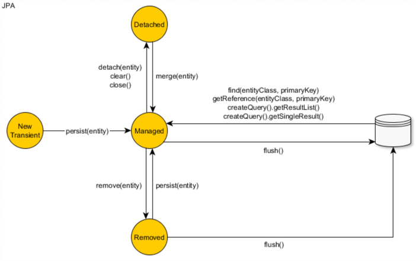

## Persistence Context

#### 1. Persistence Context
1. Entity 객체를 영구 저장하는 환경(공간, 영역)
2. EntityManager를 통해 Entity 객체를 저장하거나 조회하면 EntityManager는 Persistence Context(영속성 컨텍스트)에 Entity 보관하며 관리하게 된다.
3. Entity 객체를 Database에 저장한다고 표현되지만, 정확한 표현은 "EntityManager로 Entity 객체를 Persistence Context에 저장 한다." 이다.
4. Persistence Context는 논리적 개념으로 EntityManager가 생성될 때 하나 만들어 진다.
5. Persistence Context는 EntityManager를 통해 접근할 수 있고 관리할 수 있다.
6. [중요] EntityManager에 의해 Entity 객체가 Persistence Context에 영속화 되기 위해서는 EntityManager의 EntityTransaction 경계 안에서 영속화 작업이 일어나야만 한다.
7. [예제] ex01.ex02.domain.TestTransactionBoundary01: 단일 계층의 EntityTransaction Boundary

#### 2. JpaTransactionManager & @Transactional
1. ex01.ex02.domain.TestTransactionBoundary02: TransactionSynchronizationManage는 다중 계층의 Bean들 사이에 EntityTransaction 경계를 만든 EntityManager를 공유할 수 있게 한다.
2. ex01.ex02.domain.TestTransactionBoundary03: JpaTransactionManager는 EntityManager의 EntityTransaction 경계 관리와 TransactionSynchronizationManage의 EntityManager 공유 기능을 캡슐화 한다.
3. ex01.ex02.domain.TestTransactionBoundary04: @Transactional은 AOP 적용해 JpaTransactionManager의 EntityTransaction 관리 관심을 분리 시킨다. 

#### 3. Entity의 생명 주기
1. 비영속(new/transient)
   - 엔티티 객체를 생성한 상태로 em.persist() 호출 전 상태
   - 영속성 컨텍스트나 데이터베이스와  전혀 관계가 없는 상태

   

2. 영속(managed)
   - 엔티티 매니저를 통해 영속성 컨텍스트에 저장된 상태
   - 엔티티 가 영속성 컨텍스트에 의해 관리 되는 상태다.
   - em.find() 또는 JPQL을 사용해서 조회된 엔티티도 영속성 상태가 된다.

   
 
3. 준영속(detached)
   - 영속성 컨텍스트에  저장되었다가 분리된 상태
   - 영속성 컨텍스트가 관리하던 영속성 상태의 엔티티를 더이상 관리하지 않으면 준영속 상태가 된다.
   - em.detach() 호출하면서 영속성 상태의 엔티티를 넘겨주면 된다.
   - em.close()를 호출해서 영속성 컨텍스트를 닫으면 컨텍스트 안의 모든 엔티티는 준영속 상태가 된다.
   - em.clear()를 호출해 영속성 컨텍스트를 초기화 하면 컨텍스트 안의 모든 엔티티는 준영속 상태가 된다.

4. 삭제(removed)
   - 삭제된 상태로 엔티티를 영속성 컨텍스트와 데이터베이스에서 삭제한다.

   

5. ex02: 엔티티 조회, 등록, 수정 그리고 삭제

