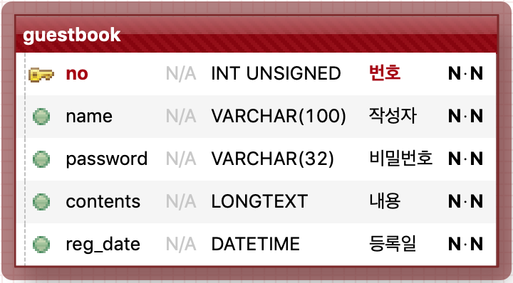
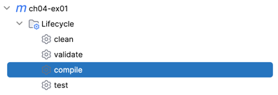
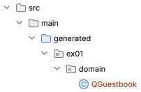
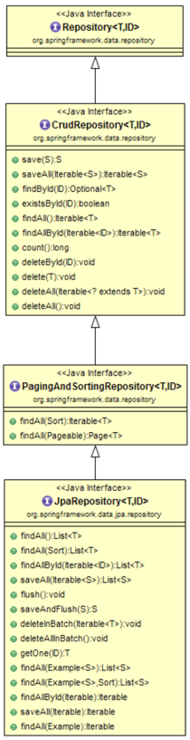

## 01. 단일(One): 방명록

#### 1. Domain

1. Table Scema

   

2. Entity

   ex01.domain.Guestbook


#### 2. Tech. Focus
1. JPQL 기반 Repository 작성
2. QueryDSL 기반 Repository 작성 
3. Spring Data JPA 기반 Repository 작성과 설정
4. 각 각의 Repository에서 Persistent 객체를 다루는 방법과 Transaction과의 관계


#### 3. ex01.repository.JpqlGuestbookRepository: based on JPQL
1. JPQL 기반 작성
2. 객체지향쿼리의 핵심은 JPQL이다. JPQL이 가장 기본이고 제일 중요
3. Criteria, QueryDSL은 문자열 쿼리 기반의 JPQL를 객체지향쿼리로 쓰기 위한 일종의 Helper Wrapping 라이브러리
4. 쿼리 로그를 보면 JPQL과 SQL이 나오는데, 이는 JPQL로 변환된 것이 최종적으로 SQL로 변환되기 때문이다.
5. 구현
   - 영속화
   - TypedQuery 객체 사용
   - Projection
   - Order by 지원
   - 집합함수: 통계 쿼리 스칼라 타입 조회

6. 테스트 I: ex01.repository.TestJpqlGuestbookRepository.testSave        
   - JpqlGuestbookRepository.save(Guestbook)
   - 객체 영속화

7. 테스트 II: ex01.repository.TestJpqlGuestbookRepository.testFindAll01
   - JpqlGuestbookRepository.findAll01()
   - TypedQuery 객체 사용
   - Order By 지원

8. 테스트 III: ex01.repository.TestJpqlGuestbookRepository.testFindAll02
    - JpqlGuestbookRepository.findAll02()
    - TypedQuery 객체 사용
    - Projection: 방명록 리스트에서는 모든 정보를 담고 있는 Guestbook Entity로 받을 필요가 없다. 이런 경우 DTO(VO) 객체에 필요한 컬럼만 프로젝션한다.
    - Order By 지원

9. 테스트 IV: ex01.repository.TestJpqlGuestbookRepository.testDelete
   - JpqlGuestbookRepository.delete(Long, String)
   - TypedQuery 객체 사용
   - 이름 기반(Named) Parameter Binding


#### 4. ex01.repository.QueryDslGuestbookRepository: QueryDSL 기반
1. QueryDSL은 JPQL을 사용하기 쉽게, 특히 Criteria 대용의 JPQL래퍼 라이브러리
2. 쿼리를 문자열 기반이 아닌 코드로 작성한다.(다양한 쿼리함수 사용법을 익혀야 한다)
3. QueryDSL를 사용하기 위한 추가 dependency가 필요
   ```
   <!-- QueryDSL -->
   <dependency>
      <groupId>com.querydsl</groupId>
      <artifactId>querydsl-jpa</artifactId>
   </dependency>
   <dependency>
      <groupId>com.querydsl</groupId>
      <artifactId>querydsl-apt</artifactId>
      <scope>provided</scope>
   </dependency>

   ```

4. QueryDSL Repository에 JPAQueryFactory를 주입하기 위한 빈설정
   ```
    @Bean
    public JPAQueryFactory jpaQueryFactory(EntityManager entityManager) {
        return new JPAQueryFactory(entityManager);
    }
        
   ```
   
5. 구현
    - QueryDSL를 편하게 쓰기 위해 JPAQueryFactory Bean을 주입 받는다.
    - 영속화 관리를 위해 EntityManager 주입 받을 필요는 없다. 부모 클래스 QuerydslRepositorySupport의 getEntityManager()를 사용한다.
    - 컴파일 오류: 쿼리타입 클래스 QGuestbook가 없기 때문에 발생!

6. QueryDSL를 위한 쿼리타입 QClass(쿼리용 클래스, Q로 시작) QGuestbook 생성하기
    - querydsl plugin 설정 (pom.xml)

      ```
      <plugin>
         <groupId>com.mysema.maven</groupId>
         <artifactId>apt-maven-plugin</artifactId>
         <version>1.1.3</version>
         <executions>
            <execution>
               <goals>
                  <goal>process</goal>
               </goals>
               <configuration>
                  <outputDirectory>src/main/generated</outputDirectory>
                  <processor>com.querydsl.apt.jpa.JPAAnnotationProcessor</processor>
                  <options>
                     <querydsl.entityAccessors>true</querydsl.entityAccessors>
                  </options>
               </configuration>
            </execution>
         </executions>
      </plugin>
      ```
   - compile goal 실행: mvn clean compile

     
        
     생성되었다!!!

     

7. 테스트 I: testSave
   - QueryDSLGuestbookRepository.save(guestbook)
   - 객체 영속화

8. 테스트 II: testFindAll01
   - QueryDSLGuestbookRepository.findAll01()
   - 쿼리 메소드 from(), orderBy(), fetch() 사용

9. 테스트 III: testFindAll02
    - QueryDSLGuestbookRepository.findAll02()
    - Projection을 위한 QueryDSL Projection, Projections.constructor(...) 사용법

10. 테스트 IV: testDelete 
    - QueryDSLGuestbookRepository.delete(Long, String)
    - 쿼리 메소드 delete(), where(), eq(), end(), execute() 사용

11. QueryDSLGuestbookRepository.count() 메소드
    - 쿼리 메소드 fetchCount()


#### 5. ex01.repository.JpaGuestbookRepository: Spring Data JPA 기반 Repository
1. 인터페이스 JpaRepository 소개
    - Spring Data JPA에서 제공하는 인터페이스이다.
    - 상속받은 Repoitory Interface에 기본적인 CRUD 메서드를 제공한다.
    - 구현체는 애플리케이션 처음 시작 시, Spring Data JPA가 자동으로 생성해서 제공해 준다.
    - 즉, 데이터 접근 계층(DAO, Repository) 개발할 때 구현 클래스 없이 인터페이스만 작성해도 개발을 완료할 수 있다.
    - 다음의 Hierachy를 참고해 보면 인터페이스 JpaRepository의 상위(super)의 정의된 메소드들도 별다른 구현없이 모두 사용할 수 있다.
      
      
   
    - 더 막강한 기능은 쿼리메소드(Query Method)다: 개발자가 정의한 메소드 이름만으로 내부에서 JPQL를 자동 생성해 준다.(예제코드 참고)
    - JPA NamedQuery 작성이 가능하다.
    - QueryDSL과 통합이 가능하다.
    - Specification를 통해 검색조건을 다양하게 조립하여 사용할 수 있다.

2. 그냥 사용할 수 있는 것은 아니고 간단한 설정을 해야 한다.    
    - 설정 클래스에 @EnableJpaRepositories 어노테이션으로 JPA Repositories 활성화해야 한다.        
    - JPA Repositories 활성화: 애플리케이션 실행 시, Spring Data JPA가 JpaRepository 인터페이스를 상속받은 Repository 인터페이스 구현체를 자동으로 생성 하게끔 한다. 
        
      ```
      @SpringBootApplication
      @EntityScan(basePackages = {"ex01.domain"})
      @EnableJpaRepositories(basePackages = {"ex01.repository"})
      public class Ex01Application {
      
         ...(생략)
      
      }
            
      ```
        
3. 구현
   - 기본적으로 JpaRepository를 상속하는 Repository 인터페이스를 생성한다.
     
     ```
     public interface JpaGuestbookRepository extends JpaRepository<Guestbook, Integer> {
     
     }
     
     ```
     
     이 코드만으로 다음과 같은 주요 메소드들을 별다른 구현없이 바로 사용할 수 있다.
   
   - CRUD 기능 : save(S), findOne(Id), exists(Id), count(), detete(T), deleteAll()
   - 정열 및 페이징 : findAll(Sort), findAll(Pageable) 
   - 여기에 2개의 쿼리 메소드 추가 정의: List<Guestbook> findAllByOrderByRegDateDesc(), Integer deleteByNoAndPassword(Integer id, String password)

4. 테스트 I: testSave()
   - CrudRepository.save(S)

5. 테스트 II: testFindAll
   - JpaRepository.findAll()

6. 테스트 III: testFindAllSortByRegDateAsc()
   - PagingAndSortingRepository.findAll(Sort)
 
7. 테스트 IV: testFindAllPagination()
   - PagingAndSortingRepository.findAll(Pageable)
   
8. 테스트 V: testFindAllByOrderByRegDateDesc
   - 쿼리메소드 예시
   - JpaGuestbookRepository.findAllByOrderByRegDateDesc()
   
9. 테스트 VI: testFindByIdAndDelete()
   - CrudRepository.findById(ID)
   - CrudRepository.delete(S)

10. 테스트 VII: testFindDeleteById()
    - CrudRepository.deleteById(id)
    
11. 테스트 VIII: testDeleteByNoAndPassword
    - 쿼리메소드 예시
    - JpaGuestbookRepository.deleteByNoAndPassword(id, password)