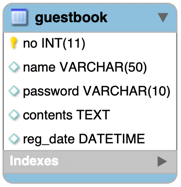

## 1. Mapping

#### 1. Domain

1. Table Scema

   

2. Entity

   ex01.domain.Guestbook

#### 2. Tech. Focus
1. JPQL 기반 Repository 작성
2. QueryDSL 기반 Repository 작성
3. Spring Data JPA 기반 Repository 작성과 설정
4. 각 각의 Repository에서 Persistent 객체를 다루는 방법과 Transaction과의 관계