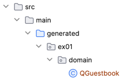

## 3. ex01.repository.QuerydslGuestbookRepository: QueryDSL 기반

#### 1. QueryDSL은 JPQL을 사용하기 쉽게, 특히 Criteria 대용의 JPQL래퍼 라이브러리

#### 2. 쿼리를 문자열 기반이 아닌 코드로 작성한다.(다양한 쿼리함수 사용법을 익혀야 한다)

#### 3. QueryDSL를 사용하기 위한 추가 dependency가 필요

```
<!-- QueryDSL -->

<dependency>
    <groupId>com.querydsl</groupId>
    <artifactId>querydsl-jpa</artifactId>
</dependency>

<dependency>
    <groupId>com.querydsl</groupId>
    <artifactId>querydsl-apt</artifactId>
    <scope>provided</scope>
</dependency>

```

#### 4. QueryDSL Repository에 JPAQueryFactory를 주입하기 위한 빈설정

```java

@Bean
public JPAQueryFactory jpaQueryFactory(EntityManager entityManager) {
    return new JPAQueryFactory(entityManager);
}

```

#### 5. 구현

1. QueryDSL를 편하게 쓰기 위해 JPAQueryFactory Bean을 주입 받는다.
2. 영속화 관리를 위해 EntityManager 주입 받을 필요는 없다. 부모 클래스 QuerydslRepositorySupport의 getEntityManager()를 사용한다.
3. 컴파일 오류: 쿼리타입 클래스 QGuestbook가 없기 때문에 발생!

#### 6. QueryDSL를 위한 쿼리타입 QClass(쿼리용 클래스, Q로 시작) QGuestbook 생성하기

1. querydsl plugin 설정 (pom.xml)

    ```xml
    
    <plugin>
        <groupId>com.mysema.maven</groupId>
        <artifactId>apt-maven-plugin</artifactId>
        <version>1.1.3</version>
        <executions>
            <execution>
                <goals>
                    <goal>process</goal>
                </goals>
                <configuration>
                    <outputDirectory>src/main/generated</outputDirectory>
                    <processor>com.querydsl.apt.jpa.JPAAnnotationProcessor</processor>
                    <options>
                        <querydsl.entityAccessors>true</querydsl.entityAccessors>
                    </options>
                </configuration>
            </execution>
        </executions>
    </plugin>
    
    ```
2. compile goal 실행: mvn clean compile

   

   생성되었다!!!

   

#### 7. 테스트 I: testSave

1. QueryDSLGuestbookRepository.save(guestbook)
2. 객체 영속화

#### 8. 테스트 II: testFindAll01

1. QueryDSLGuestbookRepository.findAll01()
2. 쿼리 메소드 from(), orderBy(), fetch() 사용

#### 9. 테스트 III: testFindAll02

1. QueryDSLGuestbookRepository.findAll02()
2. Projection을 위한 QueryDSL Projection, Projections.constructor(...) 사용법

#### 10. 테스트 IV: testDelete

1. QueryDSLGuestbookRepository.delete(Long, String)
2. 쿼리 메소드 delete(), where(), eq(), end(), execute() 사용

#### 11. count()

1. 쿼리 메소드 fetchCount()
