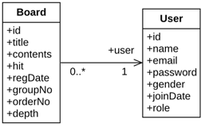

## 1. Mapping

#### 1. Domain

1. 테이블 연관관계 VS 객체 연관관계

   

   

2. 엔티티 연관관계 매핑의 3가지 기준
    1) 방향성(Direction): 객체지향의 Association에 가까운 개념
    2) 다중성(Multiplicity): 데이터베이스 Relation에 가까운 개념
    3) 연관관계의 주인(Owner of Associations)

3. 서비스(비즈니스, 도메인)에서 방향성을 결정한다.
    1) 게시판의 경우, 게시판 리스트 화면에서 작성자를 표시해야 경우가 많다. (Board -> User, Navigational Association)
    2) 반대로 특정 사용자의 글들을 가져와야 하는 경우는 경험상 흔치 않다
    3) 필요하다면, User->Board 관계도 잡으면 된다. 이 결정은 전적으로 서비스 도메인에 달려있다.
    4) 이 모델에서는 단방향(Unidirection)으로 결정한다.

4. 다중성은 방향성이 결정나면 쉽게 결정 할 수 있다.
    1) ManyToOne, OneToMany 또는 OneToOne를 결정하는 것은 쉽다.
    2) 참조를 해야만 하는 엔티티 기준으로 결정하면 된다.
    3) 참조를 해야만 하는 엔티티(연관관계의 주인)이 되는 엔티티를 왼쪽에 두고 생각한다.
    4) A -> B 인 경우, A 기준이다. 따라서, Board -> User에서는 Board가 기준이다.
    5) 데이터 모델링 Relation에서, Board가 Many, User가 One 이므로 ManyToOne 이다.

5. 단방향에서는 연관관계의 주인을 따지지 않아도 된다.
    1) 연관관계의 주인은 관계를 바꿀 수 있는 필드를 의미한다.
    2) 연관관계의 단방향 매핑에서는 연관관계 매핑을 하는 엔티티의 필드에만 하기 때문에 사실 관계주인 설정을 하지 않는다.
    3) 주인이 없는 것이 아니라 당연히 이 필드가 주인이기 때문에 설정을 하지 않는다.

#### 2. Entity Class: Board, User

1. ex02.domain.Board

   ```
   
   ...(생략)
   
   @ManyToOne
   @JoinColumn(name = "user_no")
   private User user;

   ...(생략)
   
   ```

    1) 관계의 주인이 되는 엔티티에 연관관계 매핑을 한다.
    2) 데이터베이스 테이블에서는 N:1 관계에서는 N쪽에 외래키를 둔다. 연과관계 매핑에서도 마찬가지다.
    3) @ManyToOne: 다중성 결정 어노테이션
    4) @JoinColumn: 외래키(조인칼럼)을 어노테이션과 함께 속성값으로 지정한다.

2. ex02.domain.User
    1) 엔티티 매핑만 하면 된다.
    2) 당연히, 단방향에서는 관계의 주인이 아닌 엔티티는 연관관계 매핑을 하지 않는다. (관계 매핑필드 자체가 존재하지 않음)

#### 3. Tech. Focus

1. JPQL 기반 Repository 작성
2. QueryDSL 기반 Repository 작성
3. Spring Data JPA 기반 Repository 작성
4. ManyToOne(Unidirection)에서 left outer join, inner join, join fetch의 차이점과 성능이슈
5. 세 종류(JPQL, QueryDSL, Spring Data JPA)의 각각의 Repository 작성에서 프로젝션, 페이징, 소팅, Like 검색 등의 작성방법
6. Spring Data JPA Repository가 제공하는 기본 메소드들과 이름 기반의 쿼리메소드들이 생성하는 SQL들을 검증하고 QueryDSL과의 통합이 필수임을 재확인
7. 참조 Entity(User)를 fecth하는 전략 FetchType.EAGER 와 FetchType.LAZY 이해
 
 


