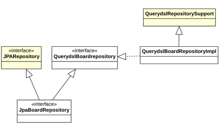
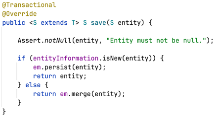

## 3. ex02.repository.JpaBoardRepository: based on QueryDSL with Spring Data JPA

#### Notes

1. 실무에서는 Spring Data JPA 기반 Respository를 많이 선호한다. 하지만, JPQL(QueryDSL) 기반의 Repository도 만들 수 있어야 최적의 JPA Repository 작성이
   가능하다.
2. 다양한 연관관계 매핑과 함께 Spring Data JPA Repository의 기본 메소드와 쿼리 메소드만을 사용하다 보면 다양한 성능 문제에 직면할 가능성이 많다.
3. 도메인의 복잡성에 따라서는 Spring Data JPA Repository의 지원으로 충분하지 못할 가능성이 높다.
4. 보통은 Spring Data JPA 기반 Respository를 기본으로 다음 두 가지 방법들을 함께 사용하는 것이 일반적이다.

    1) @Query 어노테이션과 함께 JPQL을 직접 작성
        - @Query로 JPQL을 직접 사용하는 방식
        - 부가적인 인터페이스 정의와 구현 클래스가 없기 때문에 간편해 보인다.
        - 하지만, 문자열 JPQL이 Repository 인터페이스의 자바 코드에 섞여있기 때문에 실제로는 더 복잡해지는 경우가 많다.
        - NamedQuery(MyBatis Mapper XML과 유사)가 이를 해결해 줄 수는 있지만 근본적인 해결책은 아니다.

    2) QueryDSL 통합
        - QueryDSL로 작성한 코드는 JPQL로 변환된다.
        - QueryDSL의 쿼리 메소드들은 문자열 JPQL 보다는 객체지향 쿼리 모습에 가까운 Java Friendly하게 쿼리를 작성할 수 있다.
        - 문자로 쿼리를 작성하는 것 보다는 코드로 작성하는 것이 오타로 인한 실행타임 오류를 사전에 막을 수 있다.

5. 결론
    1) JPQL을 완벽하게 이해한다.
    2) Spring Data JPA 기반의 Repository를 작성하여 Spring Data JPA Repository의 기본 메소드와 쿼리 메소드들을 사용한다.
    3) 성능 이슈와 비지니스 요구사항을 고려하여 Spring Data JPA 기반의 Repository와 QueryDSL을 통합한다.

#### JPA Repository와 QueryDSL 통합하기

1. JPA Repostory 작성
    1) JpaRepository를 상속하는 Repository 인터페이스를 생성하는 기존의 방식과 같다.
    2) ex02.repository.JpaBoardRepository

       ```java
       public interface JpaBoardRepository extends JpaRepository<Board, Integer> {
       
       }
       
       ```

2. QueryDSL Repositry 작성

    1) QuqeryDSL Repository 인터페이스 설계
        - QueryDSL로 구현할 CRUD 메소드들을 정의한다.
        - 예제: ex02.repository.querydsl.QuerydslBoardRepository

          ```java
          
          public interface QuerydslBoardRepository {
          
              public List<Board> findAllByOrderByRegDateDesc();
         
          }
          
          ```

    2) QuqeryDSL Repository 인터페이스 구현: 인터페이스 구현 클래스는 2가지 반드시 지켜야할 규칙이 있다.
        - Spring Data JPA에서 제공하는 QuerydslRepositorySupport를 상속해야 한다.
        - 구현 클래스 이름은 반드시 인터페이스 이름에 'Impl'로 끝나야 한다.
        - 예제: ex02.repository.querydsl.QuerydslBoardRepositoryImpl

          ```java
            
          public class QuerydslBoardRepositoryImpl extends QuerydslRepositorySupport implements QuerydslBoardRepository {
             
             private JPAQueryFactory queryFactory;
          
             public QuerydslBoardRepositoryImpl(JPAQueryFactory queryFactory) {
                 super(Board.class);
                 this.queryFactory = queryFactory;
             }

             @Override
             public List<Board> findAllByOrderByRegDateDesc02() {
             
                // 구현 생략
          
             }
          }
          
          ```

3. 통합하기
    1) JPA Repository를 상속한 인테페이스에 정의한 QueryDSL 인터페이를 상속하면 통합은 끝이다.
    2) 예제: ex02.repository.JpaBoardRepository

       ```java
       
        public interface JpaBoardRepository extends JpaRepository<Board, Integer>, QuerydslBoardRepository {
        
        }
       
       ```

4. 전체 클래스 다이어그램은 다음과 같다.

   

#### 테스트 01: testSave

1. 기본 메소드 CrudRepository.save(s)
2. CrudRepository.save(s)에 대한 오해

   

    1) insert만 하는 메소드가 아니다. update도 한다.
    2) insert가 되면 파라미터로 전달받은 객체는 영속화가 된다.
    3) update에서는 파라미터로 전달받은 객체는 값만 복사하는데 사용되기 때문에 영속화가 되지 않는다.
    4) save() 메소드 호출 후, 영속객체를 사용해야 하면 반환되는 객체를 사용하여야 한다. 반환되는 객체는 영속화를 보장한다.

#### 테스트 02: testFindById

1. 기본 메소드 CrudRepository.findById()
2. Outer Join
3. JPA에서는 left outer join만 지원한다.
4. JPQL 사용하는 것은 TestJpqlRepository 에서 확인 한 것 처럼 Select 쿼리가 2번 실행하기 때문에 기본 메소드 CrudRepository.findById()를 사용한다.
5. Left Outer Join 쿼리 로그 확인해 볼 것.

#### 테스트 03: testFindById02

1. repository.querdsl.QuerydslBoardRepository.findById02(no)
2. 기본 메소드 CrudRepository.findById()는 join은 되지만 Projection이 이슈가 되면 사용하지 못한다.
3. QueryDSL Projection으로 해결
4. (Inner) Join을 사용한다.
5. Projection에서는 setter를 사용하는 Projections.fields()를 사용
6. Projection 타겟 객체는 BoardDto 이다.

#### 테스트 04: testFindAllByOrderByRegDateDesc

1. 쿼리 메소드 JpaBoardRepository.findAllByOrderByRegDateDesc()
2. 쿼리 로그를 보면, join을 하지 않는 것을 확인할 수 있다.
3. @ManyToOne fetch의 기본은 EAGER이기 때문에 각각의 Board가 참조하고 있는 User의 정보를 얻어오기 위해 select가 여러번 실행된다.
4. User가 영속객체이기 때문에 1차 캐시가 되면(중복되는 게시물 작성자) User를 가져오기 위해 게시물 전체에 대한 select User는 하지 않을 것이다.
5. 성능이슈: 대용량 게시판에선 문제가 될 수 있다.

#### 테스트 05: testFindAllByOrderByRegDateDesc02

1. repository.querdsl.QuerydslBoardRepository.findAllByOrderByRegDateDesc02()
2. testFindAllByOrderByRegDateDesc의 JpaBoardRepository.findAllByOrderByRegDateDesc()의 문제를 해결한다.
3. QueryDSL Fetch Join을 사용

#### 테스트 06: testFindAllByOrderByRegDateDesc03

1. repository.querdsl.QuerydslBoardRepository.findAllByOrderByRegDateDesc03()
2. repository.querdsl.QuerydslBoardRepository.findAllByOrderByRegDateDesc02 에 Projection 기능을 추가
3. QueryDSL Inner Join을 사용
4. Projections.fields()를 통해 setter를 활용한다.
5. 주의할 것은 Projection을 사용하면 fetch join이 대상 엔티티는 별칭을 가질 수 없기 때문에 fetch join을 사용할 수 없다.
6. Projection 이슈에서는 Inner Join만 가능하다.

#### 테스트 07: testFindAllByOrderByRegDateDesc03Pagination

1. repository.querdsl.QuerydslBoardRepository.findAllByOrderByRegDateDesc03(page, size)
2. repository.querdsl.QuerydslBoardRepository.findAllByOrderByRegDateDesc3()에 Paging 기능을 오버로딩 하였다.
3. QueryDSL의 offset(), limit()를 사용: page index는 0부터 시작

#### 테스트 08: testFindAll02Pagination

1. repository.querdsl.QuerydslBoardRepository.findAll02(pageable)
2. 기능과 만들어지는 쿼리는 repository.querdsl.QuerydslBoardRepository.findAllByOrderByRegDateDesc03(page, size)와 동일
3. 차이점은 Paging과 Sorting을 위해 Pageable 인터페이스 구현체를 파라미터로 받아 QueryDSL에 적용하고 있다.
4. OrderBy 필드를 외부에서 지정할 수 있는 장점이 있다.
5. page index는 0 부터 시작

#### 테스트 09: testFindAll02PaginationAndLikeSearching

1. repository.querdsl.QuerydslBoardRepository.findAll02(keyword, pageable)는 Like검색을 위한 keyword를 추가하였다.

#### 테스트 10: testUpdate01

1. 특별난 메소드를 사용하지 않는다.
2. 영속객체를 사용한다.
3. 선별적 컬럼 업데이트이지만 영속객체를 사용하기 때문에 전체 속성이 업데이트 된다.
4. select와 update 실행

#### 테스트 11: testUpdate02

1. repository.querdsl.update(Board)
2. update 쿼리만 실행한다.
3. 선별적 컬럼 업데이트가 가능하다.

#### 테스트 12: testDelete01

1. 기본 메소드 CrudRepository.delete(board)
2. 영속객체를 사용한다.
3. select와 delete 실행

#### 테스트 13: testDelete02

1. 본 메소드 CrudRepository.deleteById(id)
2. 영속객체를 사용한다.
3. select와 delete 실행
4. testDelete01의 CrudRepository.delete(board)와 동작은 완전 동일하다.

#### 테스트 14: testDelete03

1. repository.querdsl.QuerydslBoardRepository.delete(id)
2. QueryDSL로 구현된 메소드다.
3. delete 쿼리만 실행된다.

#### 테스트 15: testDelete04

1. repository.querdsl.QuerydslBoardRepository.delete(id, userId)
2. QueryDSL로 구현된 메소드다.
3. delete 쿼리만 실행된다.
4. 게시판 삭제 비즈니스 로직에 맞게 작성된 메소드이다.

#### 메소드: JpaBoardRepository.count()

1. 기본 메소드 CrudRepository.count()