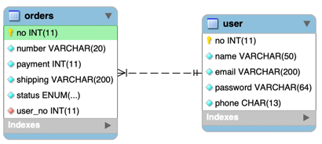

## 1. Mapping

#### 1. Domain

1. 테이블 연관관계 VS 객체 연관관계

   

   

2. 엔티티 연관관계 매핑의 3가지 기준
    1) 방향성(Direction): 객체지향의 Association에 가까운 개념
    2) 다중성(Multiplicity): 데이터베이스 Relation에 가까운 개념
    3) 연관관계의 주인(Owner of Associations)

3. 서비스(비즈니스, 도메인)에서 방향성을 결정한다.
    1) 쇼핑몰 관리자는 주문조회에서 주문의 회원정보를 확인해야 할 것이다.(Orders -> User, Navigational Association)
    2) 회원의 경우, 자신의 주문리스트를 확인해 보는 서비스의 비지니스 로직이 필요하다. (User -> Orders, Navigational Association)
    3) 따라서 Orders <-> User 연관관계 매핑은 양방향(Bidirectional) 이다.

4. 양방향에서는 연관관계의 주인을 따져야 한다.
   1) 두 개의 엔티티의 관계를 설정하는 필드가 각각의 엔티티에 있는 데, 관계를 설정하기 위해 양쪽의 필드를 세팅하는 것은 불편하고 관리가 힘들다.
   2) 따라서, 한 곳의 필드에만 주인이라 설정하고 그 필드만 세팅해서 관계를 맺도록 한다.
   3) user 필드(FK)가 있는 Orders 엔티티의 Orders.user가 관계의 주인이 된다.
   4) 외래키 세팅을 통한 관계의 변화는 Orders 엔티티의 user 필드를 세팅할 때만 변한다(이런 이유로 관계의 주인)
   5) 반대편의 List<orders>에 아무리 값을 설정해도 무시된다.(이 컬렉션 필드는 참조만 가능하다. 이런 이유로 관계의 주인이 아니다)
   6) 사실상, 외래키 설정을 하는 ManyToOne에서 관계 설정은 끝난 것이다.
   7) 양방향으로 OneToMany를 하나 더 설정하는 것은 필요(비즈니스 요구)에 따라 편리하게 객체 탐색을 하기 위해서다.

5. 다중성은 방향성이 결정나면 쉽게 결정 할 수 있다.
    1) 양방향에서는 ManyToOne, OneToMany가 다 존재하지만 관계의 주인이 되는 필드가 있는 엔티티 기준으로 ManyToOne으로 다중성을 잡는 것이 자연스럽다.
    2) 이런 이유로 양방향에서는 ManyToOne, OneToMany는 완전 동일하고 사실상 OneToMany 양방향은 없다.

#### 2. Entity Class: Board, User

1. ex03.domain.Orders

   ```
   
   ...(생략)
   
   @ManyToOne(fetch = FetchType.EAGER)
   @JoinColumn(name = "user_no")
   private User user;

   ...(생략)
   
   ```

   1) 데이터베이스 테이블에서는 N:1 관계에서는 N쪽에 외래키를 둔다. 연관관계 매핑에서도 마찬가지다.
   2) @ManyToOne: 다중성 결정 어노테이션
   3) @JoinColumn: 외래키(조인칼럼)을 어노테이션과 함께 속성값으로 지정한다.
   4) ManyToOne, OneToOne에서 Default Fetch Mode는 EAGER 이다. 

2. ex03.domain.User

   ```
   
   ...(생략)
   
	@OneToMany(mappedBy = "user", fetch = FetchType.LAZY )
	private List<Order> orders = new ArrayList<Orders>();
   
   ...(생략)
   
   ```
   1) @OneToMany: 다중성 결정 어노테이션
   2) mappedBy = "user" 주인이 누구임을 설정하는 부분이다. 반대편 엔티티의 user 필드이다.
   3) mappedBy로 설정된 필드는 주인이 아님을 설정하는 것이다.
   4) OneToMany 에서는 Default Fetch Mode는 LAZY 이다.

3. 객체 관계 설정에 주의 할점
   1) 영속성과 상관없이 순수 객체들과의 관계도 고려한 엔티티 클래스 작성을 해야 한다.
   2) 양방향 관계이기 때문에 순수 객체에서도 양방향 관계를 맺어주는 것이 좋다.
   3) 관계를 맺는 주인 필드가 세팅되는 Order.setUser() 코드에서 양방향 관계를 맺는 안전한 코드 예시이다.
        
      ```java
      public void setUser(User user) {
         this.user = user;
        
         if(!user.getOrders().contains(this)) {
            user.getOrders().add(this);
         }
      }
                   
      ```
        
   4) toString() 오버라이딩 하는 것도 주의해야 한다.
        
      ```
      public String toString() {
         return "Order{" +
                "id=" + id +
                ", number='" + number + '\'' +
                ", payment=" + payment +
                ", shipping='" + shipping + '\'' +
                ", status=" + status +
                // 무한루프조심!!!
                // ", user=" + user +
                "}";
      }
      ```

#### 3. Tech. Focus

1. QueryDSL 통합하는 Spring Data JPA 기반의 레포지토리 작성방법
2. 양방향(Bidirectional)에서 관계 필드 변경과 Update 실행 여부
3. ManyToOne 양방향(Bidirectional) 매핑에서 OneToMany 방향 엔티티는 Collection(List)가 연관 필드가 된다. 이 필드에 Collection 객체를 세팅시 필요한 Join에서 발생할 수 있는 문제점
   - OneToMany의 켈렉션 조인(inner join, outer join, fetch join)의 문제
   - OneToMany의 Default Fetch Mode인 Lazy 때문에 발생하는 N+1 문제
   - 페이징의 불가능함을 알고 그 해결방법 이해
 
 


